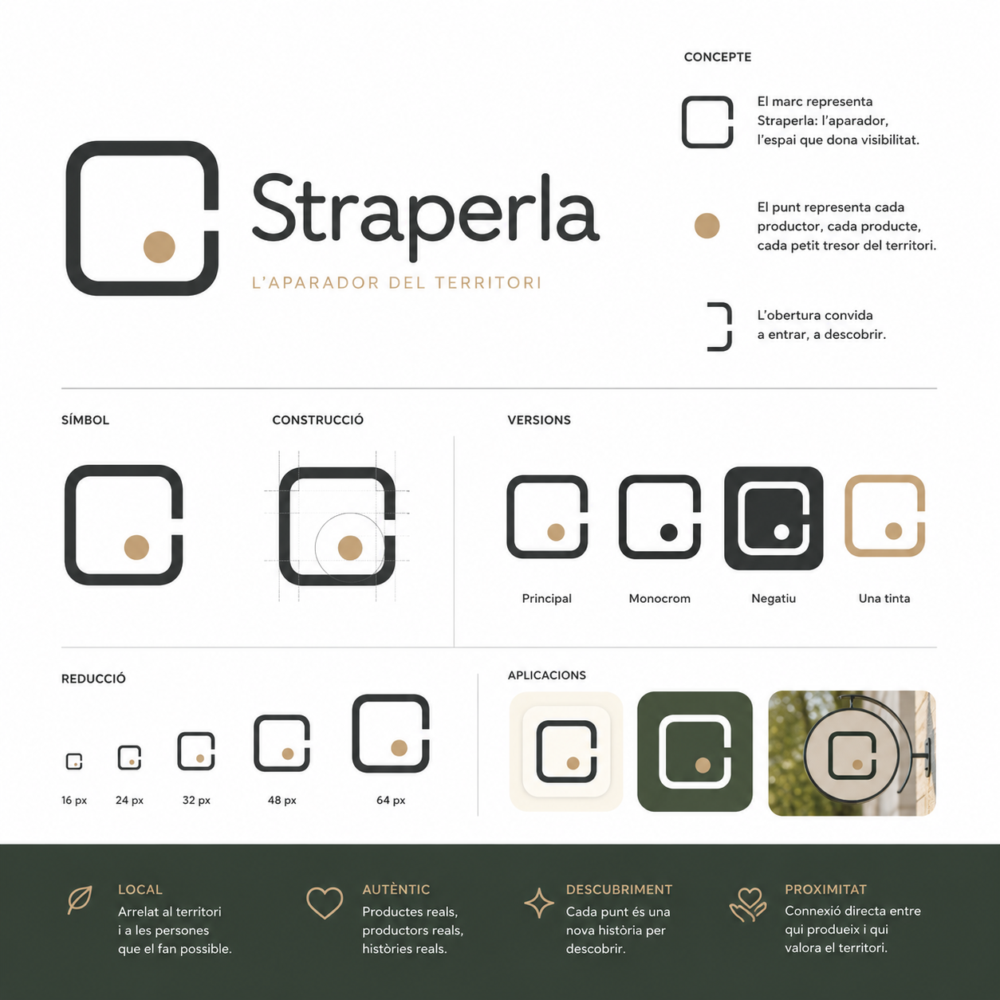
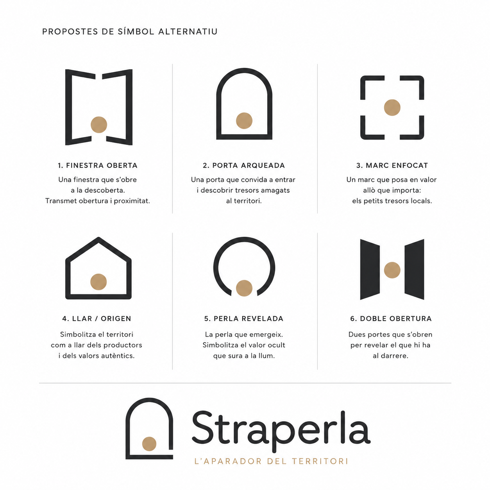

# 🎨 Visual Identity

Aquest document defineix la direcció visual de Straperla i els criteris que guiaran totes les decisions de disseny.

---

## Principis visuals

La identitat visual de Straperla ha de transmetre:

* Proximitat.
* Autenticitat.
* Descoberta.
* Territori.
* Confiança.

---

## Direcció artística

Straperla combina:

* La calidesa del territori.
* La senzillesa de la tecnologia.
* La cura dels productes artesans.

La identitat ha de ser humana i contemporània, evitant una estètica rústica o excessivament comercial.

---

## Personalitat visual

Straperla és:

🌱 Natural, però no rústica.

🤝 Proper, però no informal.

✨ Cuidada, però no elitista.

💻 Digital, però no tecnocèntrica.

---

## Elements visuals

La identitat visual es construirà a partir de:

* Tipografia clara i amb personalitat.
* Colors inspirats en territori i natura.
* Fotografies humanes i autèntiques.
* Composicions netes i amb espai.
* Elements visuals que facilitin la descoberta.

---

## Criteris a evitar

La identitat no ha de transmetre:

* Producte gourmet elitista.
* Estètica ecològica genèrica.
* Ruralitat tradicional.
* Tecnologia freda.
* Consum agressiu.

---

## Idea visual

Straperla ha de semblar:

> Una finestra digital al valor del territori.

---

## Logotip

El logotip és la representació més sintetitzada de la identitat de Straperla.

Ha de ser senzill, recognoscible i atemporal.

No ha de representar literalment l'agricultura, sinó la idea de descoberta i de valor.

### Criteris

* Ha de funcionar tant amb el símbol com només amb la paraula «Straperla».
* Ha de ser llegible en mides petites.
* Ha de poder utilitzar-se en una sola tinta.
* Ha de transmetre proximitat i confiança.
* Ha d'evitar recursos gràfics excessivament evidents o genèrics.

## Exploració del logotip

Abans de definir el logotip final, s'exploraran diferents conceptes que representin la idea central de Straperla.

L'objectiu no és representar l'agricultura, sinó el valor ocult que espera ser descobert.

Els primers conceptes exploren la relació entre:

- una perla com a metàfora del valor;
- un marc, finestra o aparador com a símbol de visibilitat;
- la simplicitat com a principi de disseny.

> Les propostes següents són exploracions conceptuals, no dissenys definitius.

---

> *La identitat visual no ha de destacar més que allò que ajuda a descobrir.*