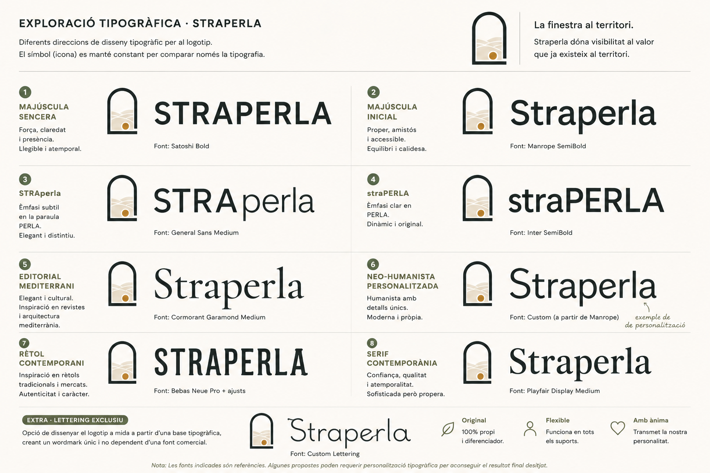

# 🪟 Logo

El logotip de Straperla representa la missió del projecte: donar visibilitat al valor que ja existeix al territori.

No representa un producte concret ni un sector agrícola determinat. Representa l'acte de descobrir.

---

# Estat actual

**Milestone:** M2 · Brand

**Estat:** 🟡 Concepte aprovat

Actualment es considera aprovat:

- ✅ el concepte del logotip;
- ✅ el símbol.

Queden pendents únicament els refinaments tipogràfics del *wordmark*, que es reprendran durant el desenvolupament de la identitat visual (M4 · UI).

---

# Concepte

Straperla és una finestra oberta al territori.

La plataforma no crea el valor; el fa visible.

Cada productor, cada producte i cada artesà són petites perles que esperen ser descobertes.

---

# Exploració

Durant la fase de branding s'han explorat diferents direccions gràfiques i tipogràfiques.

La conclusió és clara:

- el símbol comunica correctament la identitat de Straperla;
- el concepte queda validat;
- la tipografia definitiva es decidirà quan existeixi el sistema complet de tipografia i UI.

Aquest enfocament permet prendre la decisió dins del context real de la marca i no únicament observant el logotip de forma aïllada.

---

# Elements del símbol

## El marc

Representa Straperla.

És l'aparador, la finestra que permet descobrir el territori.

Simbolitza:

- visibilitat;
- descoberta;
- confiança;
- proximitat.

---

## El territori

L'interior del símbol suggereix el territori mitjançant formes simples i abstractes.

No pretén representar un paisatge concret, sinó evocar:

- natura;
- proximitat;
- origen;
- autenticitat.

El territori és una insinuació, no una il·lustració.

---

## La perla

La perla representa el valor.

Pot simbolitzar:

- un productor;
- un producte;
- una descoberta.

Sempre apareix com un únic element.

Cada publicació és una petita perla del territori.

---

# Principis de disseny

El logotip ha de ser:

- simple;
- recognoscible;
- atemporal;
- escalable;
- funcional en una sola tinta.

El símbol ha de funcionar tant en una icona de 24 px com en un rètol físic.

---

# Versions

Es definiran les següents variants:

- Logotip principal.
- Isotip.
- Monocrom.
- Negatiu.
- Favicon.
- Icona d'aplicació.

---

# Refinaments pendents

El concepte i el símbol es consideren aprovats.

Els ajustos futurs se centraran únicament en l'execució gràfica:

- relació entre símbol i tipografia;
- selecció i refinament del *wordmark*;
- kerning i espaiat;
- proporcions del conjunt;
- gruix del traç;
- radi de les cantonades;
- composició del territori;
- mida i posició de la perla.

No es replantejarà el concepte del logotip.

---

> *Straperla és la finestra. El territori és el protagonista. Cada producte és una petita perla per descobrir.*