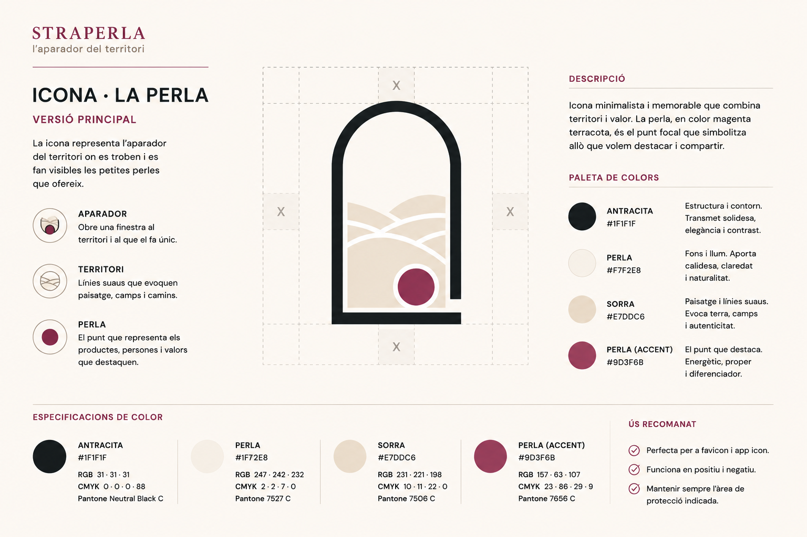

# 🎨 Colors

Aquest document defineix els criteris que guien l'ús del color a Straperla.

L'objectiu és construir una identitat visual coherent, càlida i fàcil de reconèixer, mantenint sempre el contingut com a protagonista.

---

## Principis

### El contingut és el protagonista

El color acompanya la informació, però mai competeix amb ella.

Les fotografies i els productes són els elements que han de captar l'atenció.

---

### La perla és el punt de descoberta

El color d'accent representa les petites perles del territori.

Només s'utilitza en aquells elements que volem destacar.

---

### Els neutres construeixen la interfície

La major part de la interfície utilitza una paleta neutra.

Els colors inspirats en el territori aporten llum, calma i coherència visual.

---

### El color comunica

Els colors no s'utilitzen per decorar.

Cada color ha de reforçar la identitat de la marca o comunicar informació útil a l'usuari.

---

### Menys és més

El color s'utilitza amb intenció.

Quan tot destaca, res destaca.

---

## Paleta

### Antracita

Color estructural de la marca.

S'utilitza per:

- textos principals;
- icones;
- contorns;
- estructura de la interfície.

| Propietat | Valor |
|-----------|-------|
| HEX | `#1F1F1F` |
| RGB | `31 · 31 · 31` |
| CMYK | `0 · 0 · 0 · 88` |
| Pantone | Neutral Black C |

---

### Perla

Color base de la interfície.

Aporta llum, calma i llegibilitat.

S'utilitza per:

- fons;
- superfícies;
- espais de respiració.

| Propietat | Valor |
|-----------|-------|
| HEX | `#F7F2E8` |
| RGB | `247 · 242 · 232` |
| CMYK | `2 · 2 · 7 · 0` |
| Pantone | 7527 C |

---

### Sorra

Color de suport inspirat en el territori mediterrani.

S'utilitza en:

- il·lustracions;
- detalls visuals;
- superfícies secundàries.

| Propietat | Valor |
|-----------|-------|
| HEX | `#E7DDC6` |
| RGB | `231 · 221 · 198` |
| CMYK | `10 · 11 · 22 · 0` |
| Pantone | 7506 C |

---

### Perla (Accent)

Color distintiu de Straperla.

Representa les petites perles del territori.

S'utilitza exclusivament en:

- accions principals;
- elements seleccionats;
- favorits;
- enllaços destacats;
- detalls de marca.

| Propietat | Valor |
|-----------|-------|
| HEX | `#9D3F6B` |
| RGB | `157 · 63 · 107` |
| CMYK | `23 · 86 · 29 · 9` |
| Pantone | 7656 C |

---

## Colors funcionals

La interfície incorpora també colors específics per comunicar estats del sistema.

- Success
- Warning
- Error
- Information

Aquests colors no formen part de la identitat visual de Straperla i es definiran durant el desenvolupament del sistema de components.

---

---

> *La perla és l'únic element que destaca. Tot el que l'envolta existeix perquè pugui ser descoberta.*